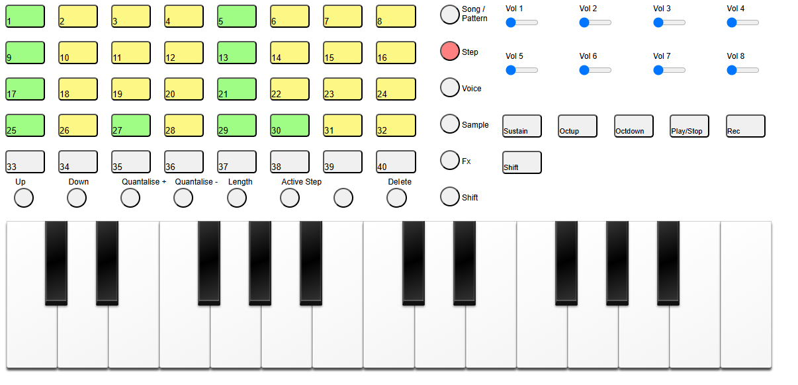

# Sampler and sequencer using the Akai APC Key 25

- Midi control via Akai APC Key 25
- Display of current state using midi sent to Akai APC Key 25
- Web audio sample playing
- Web audio sample recording

